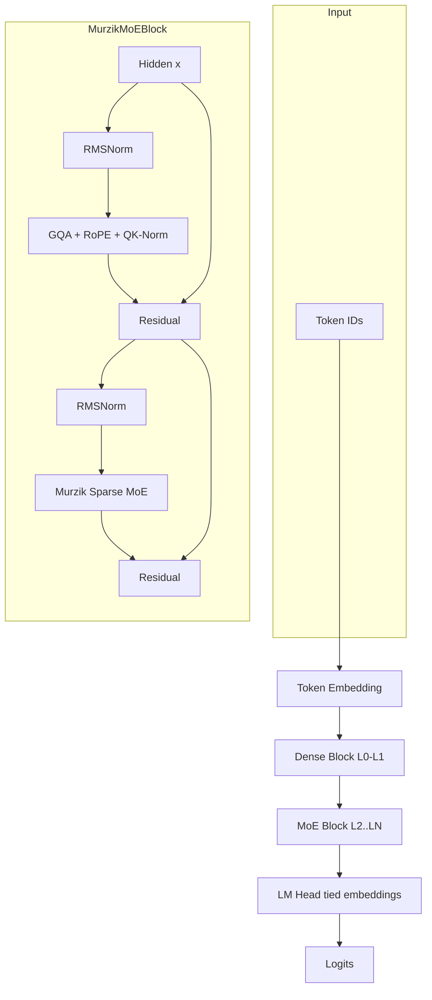
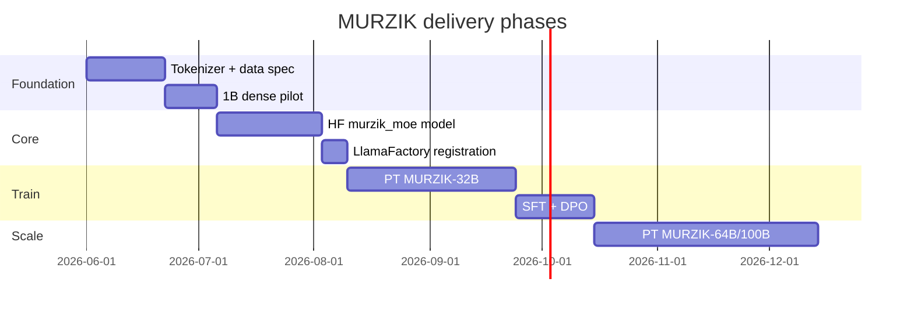

# NULLXES MURZIK — System Architecture

**Codename:** MurzikMoE  
**Class:** Decoder-only causal LM, sparse MoE FFN, chat-native  
**Status:** Design v1.0 (2026-05-30)

---

## 1. Executive summary

MURZIK is a **custom-weight** MoE language model—not a fine-tune or structural fork of Qwen, DeepSeek, or Llama. It adopts **published best practices** (GQA, SwiGLU, RMSNorm, fine-grained routed experts, shared experts, bias-based load balancing) while using **original hyperparameters, naming, and implementation** under the `murzik` model type in Hugging Face Transformers + LlamaFactory.

**Recommended first ship:** MURZIK-32B (~5B active) — fits 4–8× H100 pretrain with expert parallelism; strong chat quality per FLOP.

---

## 2. Architectural principles

### 2.1 What we take from the literature (ideas, not code)

| Idea | Source lineage | MURZIK adaptation |
|------|----------------|-------------------|
| Fine-grained experts | DeepSeekMoE | 96–160 routed experts; expert FFN width = 1/4 dense FFN |
| Shared experts | DeepSeekMoE | 2–4 always-on experts per MoE layer |
| Bias-based load balance | DeepSeek-V3 | `expert_bias` updated online; minimal aux loss |
| GQA | Llama 2/3, Qwen | 32–64 KV heads vs 32–56 Q heads |
| QK norm | Qwen3 | RMSNorm on Q/K per head |
| YaRN RoPE | Qwen, Llama | Base 32K train; YaRN to 128K for SFT/export |
| Chat template | Custom | `murzik` template in LlamaFactory (not qwen/deepseek) |

### 2.2 What makes it legally/technically “not a fork”

- New `model_type: "murzik_moe"` in Transformers
- Independent config schema (`MurzikMoeConfig`)
- Random initialization (no upstream weight import for release builds)
- Custom tokenizer vocabulary trained on NULLXES corpora
- Distinct expert counts, layer pattern, and routing hyperparameters

---

## 3. MurzikMoE block diagram



---

## 4. Murzik Sparse MoE layer

Per MoE layer (layers ≥ `first_k_dense_replace`, default **2**):

```
gate(x) = softmax(W_gate · x)           # [batch, seq, num_experts]
topk_idx, topk_w = top_k(gate + expert_bias, k=num_experts_per_tok)

y_shared = Σ SharedExpert_i(SwiGLU(x))   # always active
y_routed = Σ topk_w_j · Expert_j(x)      # token-choice routing

y = y_shared + y_routed
```

**Load balancing (aux-loss-free primary path):**

- Maintain `expert_bias ∈ R^E` (non-trainable buffer, updated each step)
- If expert load > target: `bias_e -= γ`; if underloaded: `bias_e += γ`
- Fallback aux loss coef `1e-3` only if routing collapse detected in pilot

**Why first layers are dense:** Layer 0–1 stay dense FFN (DeepSeek observation: routing balance converges slowly at the bottom).

---

## 5. Attention (MurzikGQA)

| Component | Setting |
|-----------|---------|
| Mechanism | Multi-head self-attention, causal mask |
| GQA | `num_attention_heads` / `num_key_value_heads` = 4:1 … 8:1 |
| QK normalization | RMSNorm on head_dim for Q and K |
| RoPE | `rope_theta = 1e6`, YaRN for extension |
| Dropout | 0.0 pretrain; 0.0–0.05 optional SFT |
| KV cache | Standard GQA cache (MLA deferred to v2 for simplicity) |

*v2 roadmap:* optional Multi-head Latent Attention (MLA) for 128K+ inference efficiency—add after 32B SFT baseline.

---

## 6. Model configurations

Parameter counts are **targets**; exact totals depend on vocab (default 128K) and tie-embedding.

### 6.1 MURZIK-32B (MVP)

```yaml
# configs/model/murzik_32b.json — summary
vocab_size: 128256
hidden_size: 2560
intermediate_size: 9728          # dense FFN (layers 0-1)
num_hidden_layers: 40
num_attention_heads: 32
num_key_value_heads: 8
head_dim: 128

# MoE (layers 2-39)
decoder_sparse_step: 1
num_experts: 96
num_experts_per_tok: 6
moe_intermediate_size: 2432      # 9728 / 4
num_shared_experts: 2
first_k_dense_replace: 2

max_position_embeddings: 32768
rope_scaling: null               # add YaRN config at SFT
torch_dtype: bfloat16
```

| Metric | Value |
|--------|-------|
| Total params | ~32B |
| Active / token | ~5B |
| Active ratio | ~16% |

### 6.2 MURZIK-64B

```yaml
hidden_size: 3072
intermediate_size: 12288
num_hidden_layers: 48
num_attention_heads: 48
num_key_value_heads: 8
num_experts: 128
num_experts_per_tok: 8
moe_intermediate_size: 3072
num_shared_experts: 2
```

| Metric | Value |
|--------|-------|
| Total params | ~64B |
| Active / token | ~8B |

### 6.3 MURZIK-100B

```yaml
hidden_size: 3584
intermediate_size: 14336
num_hidden_layers: 56
num_attention_heads: 56
num_key_value_heads: 8
num_experts: 160
num_experts_per_tok: 8
moe_intermediate_size: 3584
num_shared_experts: 4
```

| Metric | Value |
|--------|-------|
| Total params | ~100B |
| Active / token | ~12B |

---

## 7. Tokenizer

| Property | Value |
|----------|-------|
| Algorithm | BPE (SentencePiece) |
| Vocab | 128K (match embedding alignment to 128256 if padding) |
| Special tokens | `<|murzik|>`, `<|user|>`, `<|assistant|>`, `<|system|>`, `<|end|>` |
| Pretokenization | Unicode NFC; digits split optional for code-heavy corpora |

Train on **≥20B tokens** of in-domain text before 32B pretrain. Store on RunPod Volume: `/workspace/data/tokenizer/murzik-spm128k.model`.

---

## 8. Chat format (Murzik template)

LlamaFactory template name: `murzik`

```
<|system|>
{system_message}<|end|>
<|user|>
{user_message}<|end|>
<|assistant|>
{assistant_message}<|end|>
```

- SFT: supervise only `<|assistant|>` … `<|end|>` spans  
- DPO: same template for chosen/rejected pairs  
- No “thinking” block in v1 (add `murzik_think` template in v2 if needed)

---

## 9. Training data taxonomy

| Stage | Data | Volume (32B target) |
|-------|------|---------------------|
| **PT** | General + domain crawl, books, code, conversations (deduped) | 2–4T tokens |
| **SFT** | Curated instructions, dialogs, tool-free QA | 10–50M examples |
| **DPO** | Preference pairs from human + model judges | 100K–1M pairs |
| **Optional CPT** | Domain refresh before SFT | 50–200B tokens |

**Data hygiene (mandatory):**

- MinHash + exact dedup (cross-split leakage check)
- PII scrub pipeline
- Language ID filter + domain tags in metadata
- Provenance ledger (source, license, date) per shard

---

## 10. Evaluation harness

| Bucket | Benchmarks |
|--------|------------|
| General | MMLU, BBH, ARC, HellaSwag |
| Reasoning | GSM8K, MATH (subset) |
| Code | HumanEval, MBPP |
| Chat | MT-Bench (internal), domain-specific golden set |
| MoE health | Expert load entropy, dead expert count, aux loss |

Gate for 32B → 64B scale-up: **≥95% pilot 1B loss curve fit**, SFT MT-Bench within agreed internal threshold.

---

## 11. Software stack

| Layer | Technology |
|-------|------------|
| Model impl | PyTorch 2.4+, `murzik` in Transformers fork or PR |
| Pretrain / PT | LlamaFactory `stage: pt` + DeepSpeed ZeRO-3 + EP |
| SFT / DPO | LlamaFactory |
| Distributed | RunPod Instant Clusters, `torchrun`, NCCL `ens1` |
| Checkpoint | HF format + optimizer sharded (DeepSpeed) |
| Tracking | W&B or MLflow |
| Inference (later) | vLLM custom model registration |

---

## 12. Implementation phases



---

## 13. Risk register

| Risk | Mitigation |
|------|------------|
| Expert collapse | Bias balancing + monitor entropy; increase `γ` |
| OOM on MoE | Expert parallelism EP=8; ZeRO-3; gradient checkpointing |
| LlamaFactory no native `murzik_moe` | Register in fork; upstream PR parallel |
| RunPod preemption | Frequent async checkpoint to Network Volume |
| Legal | Clean-room impl; no weight copying; license audit on data |

---

## 14. References (ideas only)

- DeepSeekMoE (fine-grained + shared experts)
- DeepSeek-V3 (aux-loss-free balancing)
- Qwen3 MoE (GQA + QK-norm + YaRN patterns)
- LlamaFactory MoE training docs (ZeRO-3 leaf modules, `moe_aux_loss_coef`)
