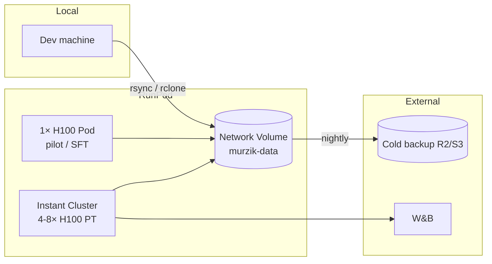

# NULLXES MURZIK — RunPod Operations

All compute for MURZIK runs on **RunPod** only. This document is the operational playbook.

---

## 1. Infrastructure map



---

## 2. Network Volume layout

Create volume **`murzik-data`** (≥ 2 TB for PT shards + checkpoints).

```
/workspace/
├── data/
│   ├── pt/              # pretrain JSONL shards
│   ├── sft/             # chat JSONL
│   ├── dpo/             # preference JSONL
│   └── tokenizer/       # murzik-spm128k.model
├── checkpoints/
│   ├── pt-32b/
│   ├── sft-32b/
│   └── dpo-32b/
├── cache/               # HF cache
└── logs/
```

Mount in every Pod/Cluster template: **Volume → `/workspace`**.

---

## 3. Pod templates

| Workload | Template | GPUs | Est. $/hr (indicative) |
|----------|----------|------|-------------------------|
| Tokenizer build | CPU 8 vCPU | 0 | low |
| 1B pilot | `runpod/Dockerfile` | 1× H100 80GB | ~$2–3 |
| SFT 32B | same | 2–4× H100 | ~$8–16 |
| PT 32B | Instant Cluster | 4–8 nodes × 8 H100 | high — budget weekly |

Use **Spot** for pilots; **On-Demand** for multi-day PT only if spot preemption rate is unacceptable.

---

## 4. Instant Cluster bootstrap

1. Create cluster: **H100 SXM**, 4 nodes (32 GPUs) minimum for 32B PT.
2. Template: custom image from `runpod/Dockerfile` (LlamaFactory + DeepSpeed + flash-attn).
3. Env (auto-set by RunPod): `PRIMARY_ADDR`, `NODE_RANK`, `NUM_NODES`, `NUM_TRAINERS`, `WORLD_SIZE`.
4. On **each node**, run:

```bash
bash /workspace/scripts/runpod/bootstrap_node.sh
bash /workspace/scripts/runpod/launch_pt_cluster.sh configs/training/pt_murzik_32b.yaml
```

5. Set `NCCL_SOCKET_IFNAME=ens1` (handled in bootstrap script).

---

## 5. Docker image

Build locally or in GitHub Actions, push to registry RunPod can pull:

```bash
docker build -f runpod/Dockerfile -t nullxes/murzik-train:latest .
```

Base: `runpod/pytorch:2.4.0-py3.11-cuda12.4.1-devel-ubuntu22.04`

---

## 6. Cost controls

| Practice | Detail |
|----------|--------|
| Spot + checkpoint | Resume from last step; never >500 step gap |
| Pilot first | 1B dense → 3B MoE → 32B |
| Auto-shutdown | Cron on primary: if loss NaN or disk >90%, stop cluster |
| Volume not Pod disk | Checkpoints on Volume survive Pod delete |
| Tag runs | `WANDB_PROJECT=murzik`, `RUN_ID=pt32b-20260615` |

---

## 7. Secrets (RunPod secrets / env)

```
WANDB_API_KEY
HF_TOKEN          # if pulling private deps only
RCLONE_CONFIG     # cold backup
```

Never commit secrets. Use RunPod Pod env UI.

---

## 8. Troubleshooting

| Symptom | Fix |
|---------|-----|
| NCCL timeout | Verify `ens1`; increase `NCCL_TIMEOUT` |
| OOM MoE | Enable EP; reduce seq len; ZeRO-3 + checkpointing |
| Expert collapse | Increase bias `γ`; bump `moe_aux_loss_coef` temporarily |
| Slow step | Check EP allreduce; ensure flash-attn installed |
| Checkpoint corrupt | Keep last 3; validate with `scripts/verify_checkpoint.py` |

---

## 9. Deployment checklist (new run)

- [ ] Volume mounted at `/workspace`
- [ ] Data shards present + checksum manifest
- [ ] Tokenizer on volume
- [ ] Config YAML reviewed (batch size × seq × GPUs)
- [ ] W&B project created
- [ ] Bootstrap script tested on 1 GPU
- [ ] Cold backup cron configured
